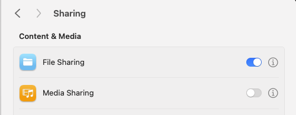
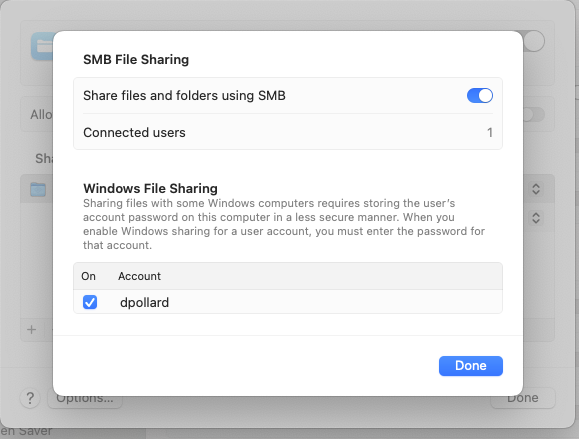

# Vagrant and QEMU on Mac with Apple Silicon (M1, M2, M3, ...?) / ARM64

## Install QEMU 
Instructions: [Vagrant QEMU plugin](https://github.com/ppggff/vagrant-qemu?tab=readme-ov-file#usage)
in summary:
```
brew install qemu
vagrant plugin install vagrant-qemu
```

## Choose a Vagrant Box
Choices: [Vagrant QEMU on arm64 Boxes](https://app.vagrantup.com/boxes/search?architecture=arm64&page=1&provider=qemu&q=ubuntu)

## Setup Synced Folders with SMB
Instructions: [Vagrant SMB](https://developer.hashicorp.com/vagrant/docs/synced-folders/smb)
In summary:
  * Open "System Preferences"
  * Click "General"
    *   
  * Check the "On" checkbox next to "File Sharing"
  * Click "Options"
  * Check "Share files and folders using SMB"
  * Check the "On" checkbox next to your username within "Windows File Sharing"
    * 
  * Click "Done"

## Update Vagrantfile
**Change the `smb_host:` value to your local IP address.**

Find your local IP address by running:
```
ifconfig | grep "192.168."
```
> If that doesn't work, you can run `ifconfig` in a terminal and look for the `inet` value under `en0` (or `en1` if you're on WiFi).

replace `"192.168.86.87"` with your local IP address.

## Run Vagrant
```
vagrant up
```

## Troubleshooting

### Kill QEMU service competing for port 50022
If you get an error about port 50022 being in use, you can do the following:
```
lsof -nP -iTCP:50022 | grep LISTEN
```
This will give you the PID of the process using the port. You can then kill the process with:
```
kill -9 <QEMU PID>
```

**Restarting your Mac**
What happens when I restart my Mac?
Should I either:
  * kill QEMU service every time
  * uninstall QEMU server or prevent it from launching on boot

